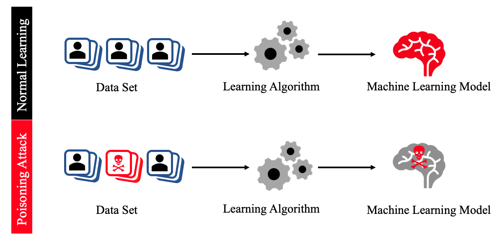

# A Survey of Poisoning Attacks and Countermeasures in Recommender Systems

A repository of poison attacks against recommender systems, as well as their countermeasures. This repository is associated with our systematic review, entitled **Manipulating Recommender Systems: A Survey of Poisoning Attacks and Countermeasures**. 

# Table of Contents

- [Poison Attacks](#Poison-Attacks)
   - [Overview](#Overview)
   - [Model-agnostic](#Model-agnostic)
   - [Model-intrinsic](#Model-intrinsic)
- [Detection Methods](#Detection-Methods)
   - [Supervised](#Supervised)
   - [Semi Supervised](#Semi-Supervised)
   - [Unsupervised](#Unsupervised)

## Poison Attacks
### Overview
Poisoning attacks are the process of tampering with the training data of a  machine learning (ML) model in order to corrupt its availability and integrity. Below figure presents the typical process of a poisoning attack  compared to the normal learning process. In the latter case, an ML  model is trained based on data, which is subsequently used to derive a 
recommendation. As such, the quality of the ML model depends on the quality of the data used for training. In a poisoning attack, data is injected into the training process, and hence the model, to produce unintended or harmful conclusions. 

### Model-agnostic
A first class of poisoning attacks has been designed to test the general robustness of a recommender
system in terms of its trustworthiness. As such, these attacks are designed to be independent of any specific prediction model, or a specific class of such models. In the remainder of this section, we review prominent examples of such model-agnostic attacks.

| **Name** | **Paper** | **Venue** | **Year** | **Data & Code** |
| --- | --- | --- | --- | --- |
| MA-01 | [Shyong K Lam and John Riedl. 2004. Shilling recommender systems for fun and profit. In Proceedings of the 13th international conference on World Wide Web. 393–402.](https://dl.acm.org/doi/10.1145/988672.988726) | WWW | 2004 | Data: [ML](https://grouplens.org/datasets/movielens/100k/) |
| MA-02 | [Junshuai Song, Zhao Li, Zehong Hu, Yucheng Wu, Zhenpeng Li, Jian Li, and Jun Gao. 2020. Poisonrec: an adaptive data poisoning framework for attacking black-box recommender systems. In 2020 IEEE 36th International Conference on Data Engineering (ICDE). IEEE, 157–168.](https://ieeexplore.ieee.org/document/9101655/) | ICDE | 2020 | Data: [St](https://www.kaggle.com/datasets/tamber/steam-video-games), [AMV](http://jmcauley.ucsd.edu/data/amazon/), [ML](https://grouplens.org/datasets/movielens/100k/) |
| MA-03 | [Jiaxi Tang, Hongyi Wen, and Ke Wang. 2020. Revisiting adversarially learned injection attacks against recommender systems. In Fourteenth ACM Conference on Recommender Systems. 318–327.](https://dl.acm.org/doi/10.1145/3383313.3412243) | RecSys | 2020 | Data: [GOW](http://snap.stanford.edu/data/loc-Gowalla.html)   Code: [Python](https://github.com/graytowne/revisit_adv_rec) |
| MA-04 | [Chen Lin, Si Chen, Hui Li, Yanghua Xiao, Lianyun Li, and Qian Yang. 2020. Attacking recommender systems with augmented user profiles. In Proceedings of the 29th ACM International Conference on Information & Knowledge Management. 855–864.](https://dl.acm.org/doi/10.1145/3340531.3411884) | CIKM | 2020 | Data:  [ML](https://grouplens.org/datasets/movielens/100k/), [FT](https://guoguibing.github.io/librec/datasets.html), [AAT](http://jmcauley.ucsd.edu/data/amazon/) |
| MA-05 | [Chenwang Wu, Defu Lian, Yong Ge, Zhihao Zhu, and Enhong Chen. 2021. Triple Adversarial Learning for Influence based Poisoning Attack in Recommender Systems. In Proceedings of the 27th ACM SIGKDD Conference on Knowledge Discovery & Data Mining. 1830–1840.](https://dl.acm.org/doi/10.1145/3447548.3467335) | KDD | 2021 | Data:  [ML](https://grouplens.org/datasets/movielens/100k/), [FT](https://guoguibing.github.io/librec/datasets.html)   Code: [Python](https://github.com/Daftstone/TrialAttack) |
| MA-06 | [Yihe Zhang, Xu Yuan, Jin Li, Jiadong Lou, Li Chen, and Nian-Feng Tzeng. 2021. Reverse Attack: Black-box Attacks on Collaborative Recommendation. In Proceedings of the 2021 ACM SIGSAC Conference on Computer and Communications Security. 51–68.](https://dl.acm.org/doi/10.1145/3460120.3484805) | CSS | 2021 | Data:  [ML](https://grouplens.org/datasets/movielens/100k/), [NF](https://www.kaggle.com/datasets/netflix-inc/netflix-prize-data), [AMB & ADM](http://jmcauley.ucsd.edu/data/amazon/), [TW](https://dl.acm.org/doi/10.1145/1772690.1772751), [G+](https://dl.acm.org/doi/10.5555/2999134.2999195), [CIT](https://www.aminer.org/citation/)  |
| MA-07 | [Wenqi Fan, Tyler Derr, Xiangyu Zhao, Yao Ma, Hui Liu, Jianping Wang, Jiliang Tang, and Qing Li. 2021. Attacking Black-box Recommendations via Copying Cross-domain User Profiles. In 2021 IEEE 37th International Conference on Data Engineering (ICDE). IEEE, 1583–1594.](https://ieeexplore.ieee.org/document/9458627) | ICDE | 2021 | Data: [ML](https://grouplens.org/datasets/movielens/100k/), [NF](https://www.kaggle.com/datasets/netflix-inc/netflix-prize-data) |
| MA-08 | [Julio Barbieri, Leandro GM Alvim, Filipe Braida, and Geraldo Zimbrão. 2021. Simulating real profiles for shilling attacks: A generative approach. Knowledge-Based Systems 230 (2021), 107390.](https://www.sciencedirect.com/science/article/pii/S0950705121006523) | KBS | 2021 | Data: [ML](https://grouplens.org/datasets/movielens/100k/) |
| MA-09 | [Fan Wu, Min Gao, Junliang Yu, Zongwei Wang, Kecheng Liu, and Xu Wang. 2021. Ready for emerging threats to recommender systems? A graph convolution-based generative shilling attack. Information Sciences 578 (2021), 683–701.](https://www.sciencedirect.com/science/article/pii/S0020025521007313) | IS | 2021 | Data: [DB](https://www.kaggle.com/datasets/fengzhujoey/douban-datasetratingreviewside-information), [CI](https://paperswithcode.com/dataset/ciao)   Code: [Python](https://github.com/silentair/GOAT/tree/7c1747d40f9bc2b5b0ac5035770b3e9f2bbd5211) |
| MA-10 | [Jingfan Chen, Wenqi Fan, Guanghui Zhu, Xiangyu Zhao, Chunfeng Yuan, Qing Li, and Yihua Huang. 2022. Knowledgeenhanced Black-box Attacks for Recommendations. In Proceedings of the 28th ACM SIGKDD Conference on KnowledgeDiscovery and Data Mining. 108–117.](https://dl.acm.org/doi/abs/10.1145/3534678.3539359) | KDD | 2022 | Data: [ML](https://grouplens.org/datasets/movielens/100k/), [BC](https://www.kaggle.com/datasets/somnambwl/bookcrossing-dataset), [LA](http://millionsongdataset.com/lastfm/)  |
| MA-11 | [Hengtong Zhang, Yaliang Li, Bolin Ding, and Jing Gao. 2022. LOKI: A Practical Data Poisoning Attack Frameworkagainst Next Item Recommendations. IEEE Transactions on Knowledge and Data Engineering](https://ieeexplore.ieee.org/document/9806383) | TKDE | 2022 | Data: [ABT](http://jmcauley.ucsd.edu/data/amazon/), [St](https://www.kaggle.com/datasets/tamber/steam-video-games),[GOW](http://snap.stanford.edu/data/loc-Gowalla.html)  |
| MA-12 | [Chen Lin, Si Chen, Meifang Zeng, Sheng Zhang, Min Gao, and Hui Li. 2022. Shilling Black-Box Recommender Systems by Learning to Generate Fake User Profiles. IEEE Transactions on Neural Networks and Learning Systems (2022).](https://ieeexplore.ieee.org/stamp/stamp.jsp?arnumber=9806457) | IEEE Trans. Neural Netw. Learn. Syst | 2022 | Data: [ML](https://grouplens.org/datasets/movielens/100k/), [FT](https://guoguibing.github.io/librec/datasets.html), [YE](https://www.kaggle.com/c/yelp-recruiting/data), [AAT](http://jmcauley.ucsd.edu/data/amazon/) |

### Model-intrinsic
Model-intrinsic attacks are designed and optimised for a specific type of RS. Here, we present different attacks, grouped according to the RS type, as follows

| **Name** | **Paper** | **Venue** | **Year** | **Data & Code** |
| --- | --- | --- | --- | --- |
| MI-01 | [Bo Li, Yining Wang, Aarti Singh, and Yevgeniy Vorobeychik. 2016. Data poisoning attacks on factorization-based collaborative filtering. Advances in neural information processing systems 29 (2016), 1885–1893.](https://proceedings.neurips.cc/paper/2016/hash/83fa5a432ae55c253d0e60dbfa716723-Abstract.html) | NIPS | 2016 | Data: [ML](https://grouplens.org/datasets/movielens/100k/)   Code: [Python](https://github.com/fuying-wang/Data-poisoning-attacks-on-factorization-based-collaborative-filtering) |
| MI-02 | [Guolei Yang, Neil Zhenqiang Gong, and Ying Cai. 2017. Fake Co-visitation Injection Attacks to Recommender Systems. In NDSS.](https://people.duke.edu/~zg70/papers/ndss17-attackRS.pdf) | NDSS | 2017 | Data: [YT](https://www.kaggle.com/datasets/rsrishav/youtube-trending-video-dataset), [eB](https://www.kaggle.com/datasets/promptcloud/ebay-product-listing-dataset), [AMV](http://jmcauley.ucsd.edu/data/amazon/), [YE](https://www.kaggle.com/c/yelp-recruiting/data), [LI](https://www.kaggle.com/datasets/killbot/linkedin) |
| MI-03 | [Minghong Fang, Guolei Yang, Neil Zhenqiang Gong, and Jia Liu. 2018. Poisoning attacks to graph-based recommender systems. In Proceedings of the 34th Annual Computer Security Applications Conference. 381–392.](https://dl.acm.org/doi/10.1145/3274694.3274706) | ACSAC | 2018 | Data: [ML](https://grouplens.org/datasets/movielens/100k/), [AMV](http://jmcauley.ucsd.edu/data/amazon/) |
| MI-04 | [Konstantina Christakopoulou and Arindam Banerjee. 2019. Adversarial attacks on an oblivious recommender. In Proceedings of the 13th ACM Conference on Recommender Systems. 322–330.](https://dl.acm.org/doi/10.1145/3298689.3347031) | RecSys | 2019 | Data: [ML](https://grouplens.org/datasets/movielens/100k/) |
| MI-05 | [Rui Hu, Yuanxiong Guo, Miao Pan, and Yanmin Gong. 2019. Targeted poisoning attacks on social recommender systems. In 2019 IEEE Global Communications Conference (GLOBECOM). IEEE, 1–6.](https://ieeexplore.ieee.org/document/9013539) | GLOBECOM | 2019 | Data: [FT](https://guoguibing.github.io/librec/datasets.html) |
| MI-06 | [Huiyuan Chen and Jing Li. 2019. Data poisoning attacks on cross-domain recommendation. In Proceedings of the 28th ACM International Conference on Information and Knowledge Management. 2177–2180.](https://dl.acm.org/doi/10.1145/3357384.3358116) | CIKM | 2019 | Data: [NF](https://www.kaggle.com/datasets/netflix-inc/netflix-prize-data), [ML](https://grouplens.org/datasets/movielens/100k/) |
| MI-07 | [Hengtong Zhang, Yaliang Li, Bolin Ding, and Jing Gao. 2020. Practical data poisoning attack against next-item recommendation. In Proceedings of The Web Conference 2020. 2458–2464.](https://dl.acm.org/doi/10.1145/3366423.3379992) | WWW | 2020 | Data: [ABT](http://jmcauley.ucsd.edu/data/amazon/) |
| MI-08 | [Minghong Fang, Neil Zhenqiang Gong, and Jia Liu. 2020. Influence function based data poisoning attacks to top-n recommender systems. In Proceedings of The Web Conference 2020. 3019–3025.](https://dl.acm.org/doi/10.1145/3366423.3380072) | WWW | 2020 | Data: [YE](https://www.kaggle.com/c/yelp-recruiting/data), [ADM](http://jmcauley.ucsd.edu/data/amazon/) |
| MI-09 | [Liang Chen, Yangjun Xu, Fenfang Xie, Min Huang, and Zibin Zheng. 2021. Data poisoning attacks on neighborhoodbased recommender systems. Transactions on Emerging Telecommunications Technologies 32, 6 (2021), e3872.](https://onlinelibrary.wiley.com/doi/full/10.1002/ett.3872) | ETT | 2021 | Data: [FT](https://guoguibing.github.io/librec/datasets.html), [ML](https://grouplens.org/datasets/movielens/100k/), [AMV](http://jmcauley.ucsd.edu/data/amazon/) |
| MI-10 | [Hengtong Zhang, Changxin Tian, Yaliang Li, Lu Su, Nan Yang, Wayne Xin Zhao, and Jing Gao. 2021. Data Poisoning Attack against Recommender System Using Incomplete and Perturbed Data. In Proceedings of the 27th ACM SIGKDD Conference on Knowledge Discovery & Data Mining. 2154–2164.](https://dl.acm.org/doi/10.1145/3447548.3467233) | KDD | 2021 | Data: [ML](https://grouplens.org/datasets/movielens/100k/), [AIV](http://jmcauley.ucsd.edu/data/amazon/) |
| MI-11 | [Zhenrui Yue, Zhankui He, Huimin Zeng, and Julian McAuley. 2021. Black-Box Attacks on Sequential Recommenders via Data-Free Model Extraction. In Fifteenth ACM Conference on Recommender Systems. 44–54.](https://dl.acm.org/doi/10.1145/3460231.3474275) | RecSys | 2021 | Data: [ML](https://grouplens.org/datasets/movielens/100k/), [ABT](http://jmcauley.ucsd.edu/data/amazon/)   Code: [Python](https://github.com/Yueeeeeeee/RecSys-Extraction-Attack) |
| MI-12 | [Zih-Wun Wu, Chiao-Ting Chen, and Szu-Hao Huang. 2021. Poisoning attacks against knowledge graph-based recommendation systems using deep reinforcement learning. Neural Computing and Applications (2021), 1–19.](https://dl.acm.org/doi/abs/10.1007/s00521-021-06573-8) | Neural. Comput. Appl. | 2021 | Data: [ML](https://grouplens.org/datasets/movielens/100k/), [FTr](#) |
| MI-13 | [Zhuoran Liu and Martha Larson. 2021. Adversarial Item Promotion: Vulnerabilities at the Core of Top-N Recommenders that Use Images to Address Cold Start. In Proceedings of the Web Conference 2021. 3590–3602.](https://dl.acm.org/doi/10.1145/3442381.3449891) | WWW | 2021 | Data: [AMM](http://jmcauley.ucsd.edu/data/amazon/), [TC](https://www.tradesy.com/)   Code: [Python](https://github.com/liuzrcc/AIP) |
| MI-14 | [Hai Huang, Jiaming Mu, Neil Zhenqiang Gong, Qi Li, Bin Liu, and Mingwei Xu. 2021. Data poisoning attacks to deep learning based recommender systems. arXiv preprint arXiv:2101.02644 (2021). [60] Keman Huang, Michael Siegel, and Stuart Madnick. 2018. Systematically underst](https://arxiv.org/pdf/2012.10544.pdf) | arXiv | 2021 | Data: [ML](https://grouplens.org/datasets/movielens/100k/), [LA](http://millionsongdataset.com/lastfm/) |
| MI-15 | [Shijie Zhang, Hongzhi Yin, Tong Chen, Zi Huang, Quoc Viet Hung Nguyen, and Lizhen Cui. 2022. Pipattack: Poisoning federated recommender systems for manipulating item promotion. In Proceedings of the Fifteenth ACM International Conference on Web Search and Data Mining. 1415–1423.](https://dl.acm.org/doi/10.1145/3488560.3498386) | WSDM | 2022 | Data: [ML](https://grouplens.org/datasets/movielens/100k/), [AMP](http://jmcauley.ucsd.edu/data/amazon/) |
| MI-16 | [Dazhong Rong, Qinming He, and Jianhai Chen. 2022. Poisoning Deep Learning based Recommender Model in Federated Learning Scenarios. arXiv preprint arXiv:2204.13594 (2022).](https://www.ijcai.org/proceedings/2022/0306.pdf) | IJCAI | 2022 | Data: [ML](https://grouplens.org/datasets/movielens/100k/), [AMD](http://jmcauley.ucsd.edu/data/amazon/)   Code: [Python](https://github.com/rdz98/PoisonFedDLRS) |
| MI-17 | [Chuhan Wu, Fangzhao Wu, Tao Qi, Yongfeng Huang, and Xing Xie. 2022. FedAttack: Effective and Covert Poisoning Attack on Federated Recommendation via Hard Sampling. arXiv preprint arXiv:2202.04975 (2022).](https://arxiv.org/pdf/2202.04975.pdf) | Arxiv | 2022 | Data: [ML](https://grouplens.org/datasets/movielens/100k/), [ABT](http://jmcauley.ucsd.edu/data/amazon/)    Code: [Python](https://github.com/wuch15/FedAttack) |
| MI-18 | [Jingwei Yi, Fangzhao Wu, Bin Zhu, Yang Yu, Chao Zhang, Guangzhong Sun, and Xing Xie. 2022. UA-FedRec: Untargeted Attack on Federated News Recommendation. arXiv preprint arXiv:2202.06701 (2022).](https://arxiv.org/abs/2202.06701) | Arxiv | 2022 | Data: [MIND](https://msnews.github.io/), [Feeds](https://play.google.com/store/apps/details?id=com.microsoft.amp.apps.bingnews&hl=en&gl=US&pli=1)    Code: [Python](https://github.com/yjw1029/UA-FedRec) |
| MI-19 | [Toan Nguyen Thanh, Nguyen Duc Khang Quach, Thanh Tam Nguyen, Thanh Trung Huynh, Viet Hung Vu, Phi Le Nguyen, Jun Jo, and Quoc Viet Hung Nguyen. 2023. Poisoning GNN-based recommender systems with generative surrogate-based attacks. ACM Transactions on Information Systems 41, 3 (2023)](https://doi.org/10.1145/3567420) | ACM TOIS | 2023 | Data: [FR](https://arxiv.org/abs/1505.03014), [ML](https://grouplens.org/datasets/movielens/100k/), [AM](http://jmcauley.ucsd.edu/data/amazon/), [LF](http://millionsongdataset.com/lastfm/) |

## Detection Methods
In this section, we review detection methods in more detail, starting with supervised methods, before turning to semi-supervised methods and unsupervised methods

### Supervised
| **Name** | **Paper** | **Venue** | **Year** |
| --- | --- | --- | --- | 
| CM-01 | [Paul-Alexandru Chirita, Wolfgang Nejdl, and Cristian Zamfir. 2005. Preventing shilling attacks in online recommender systems. In Proceedings of the 7th annual ACM international workshop on Web information and data management. 67–74.](https://dl.acm.org/doi/10.1145/1097047.1097061) | WIDM | 2005 |
| CM-02 | [Robin Burke, Bamshad Mobasher, Chad Williams, and Runa Bhaumik. 2006. Classification features for attack detection in collaborative recommender systems. In Proceedings of the 12th ACM SIGKDD international conference on Knowledge discovery and data mining. 542–547.](https://dl.acm.org/doi/10.1145/1150402.1150465) | KDD | 2006 | 
| CM-03 | [Robin Burke, Bamshad Mobasher, Chad Williams, and Runa Bhaumik. 2006. Detecting profile injection attacks in collaborative recommender systems. In The 8th IEEE International Conference on E-Commerce Technology and The 3rd IEEE International Conference on Enterprise Computing, E-Commerce, and E-Services (CEC/EEE’06). IEEE, 23–23.](https://dl.acm.org/doi/10.1109/CEC-EEE.2006.34) | CEC-EEE | 2006 | 
| CM-04 | [Bamshad Mobasher, Robin Burke, Runa Bhaumik, and Chad Williams. 2007. Toward trustworthy recommender systems: An analysis of attack models and algorithm robustness. ACM Transactions on Internet Technology (TOIT) 7, 4 (2007), 23–es.](https://dl.acm.org/doi/10.1145/1278366.1278372) | TOIT | 2007 | 
| CM-05 | [Fuzhi Zhang and Quanqiang Zhou. 2012. A Meta-learning-based Approach for Detecting Profile Injection Attacks in Collaborative Recommender Systems. J. Comput. 7, 1 (2012), 226–234](http://www.jcomputers.us/vol7/jcp0701-26.pdf) | J. Comput. | 2012 | 
| CM-06 | [Fuzhi Zhang and Quanqiang Zhou. 2014. HHT–SVM: An online method for detecting profile injection attacks in collaborative recommender systems. Knowledge-Based Systems 65 (2014), 96–105.](https://www.sciencedirect.com/science/article/pii/S0950705114001427) | KBS | 2014 | 
| CM-07 | [Wei Zhou, Junhao Wen, Qingyu Xiong, Min Gao, and Jun Zeng. 2016. SVM-TIA a shilling attack detection method based on SVM and target item analysis in recommender systems. Neurocomputing 210 (2016), 197–205.](https://dl.acm.org/doi/10.1016/j.neucom.2015.12.137) | J. Neucom. | 2016 | 
| CM-08 | [Zhihai Yang, Lin Xu, Zhongmin Cai, and Zongben Xu. 2016. Re-scale AdaBoost for attack detection in collaborative filtering recommender systems. Knowledge-Based Systems 100 (2016), 74–88.](https://www.sciencedirect.com/science/article/pii/S0950705116000861) | KBS | 2016 | 
| CM-09 | [Yaojun Hao, Fuzhi Zhang, Jian Wang, Qingshan Zhao, and Jianfang Cao. 2019. Detecting shilling attacks with automatic features from multiple views. Security and Communication Networks 2019 (2019).](https://www.hindawi.com/journals/scn/2019/6523183/) | Secur. Commun. Netw. | 2019 | 
| CM-10 | [Yishu Xu and Fuzhi Zhang. 2019. Detecting shilling attacks in social recommender systems based on time series analysis and trust features. Knowledge-Based Systems 178 (2019), 25–47.](https://dl.acm.org/doi/abs/10.1016/j.knosys.2019.04.012) | KBS | 2019 | 
| CM-11 | [Quanqiang Zhou, Jinxia Wu, and Liangliang Duan. 2020. Recommendation attack detection based on deep learning. Journal of Information Security and Applications 52 (2020), 102493.](https://www.sciencedirect.com/science/article/pii/S2214212619306131) | JISA | 2020 | 

### Semi Supervised
| **Name** | **Paper** | **Venue** | **Year** | 
| --- | --- | --- | --- | 
| CM-12 | [Zhiang Wu, Junjie Wu, Jie Cao, and Dacheng Tao. 2012. HySAD: A semi-supervised hybrid shilling attack detector for trustworthy product recommendation. In Proceedings of the 18th ACM SIGKDD international conference on Knowledge discovery and data mining. 985–993.](https://dl.acm.org/doi/10.1145/2339530.2339684) | KDD | 2012 | 
| CM-13 | [Jie Cao, Zhiang Wu, Bo Mao, and Yanchun Zhang. 2013. Shilling attack detection utilizing semi-supervised learning method for collaborative recommender system. World Wide Web 16, 5-6 (2013), 729–748.](https://link.springer.com/article/10.1007/s11280-012-0164-6) | WWW | 2013 | 

### UnSupervised
| **Name** | **Paper** | **Venue** | **Year** | 
| --- | --- | --- | --- | 
| CM-14 | [Sheng Zhang, Amit Chakrabarti, James Ford, and Fillia Makedon. 2006. Attack detection in time series for recommender systems. In Proceedings of the 12th ACM SIGKDD international conference on Knowledge discovery and data mining. 809–814.](https://dl.acm.org/doi/10.1145/1150402.1150508) | KDD | 2006 | 
| CM-15 | [Bhaskar Mehta, Thomas Hofmann, and Peter Fankhauser. 2007. Lies and propaganda: detecting spam users in collaborative filtering. In Proceedings of the 12th international conference on Intelligent user interfaces. 14–21.](https://dl.acm.org/doi/10.1145/1216295.1216307) | IUI | 2007 | 
| CM-16 | [Kenneth Bryan, Michael O’Mahony, and Pádraig Cunningham. 2008. Unsupervised retrieval of attack profiles in collaborative recommender systems. In Proceedings of the 2008 ACM conference on Recommender systems. 155–162.](https://dl.acm.org/doi/10.1145/1454008.1454034) | RecSys | 2008 | 
| CM-17 | [Bhaskar Mehta and Wolfgang Nejdl. 2009. Unsupervised strategies for shilling detection and robust collaborative filtering. User Modeling and User-Adapted Interaction 19, 1 (2009), 65–97.](https://link.springer.com/article/10.1007/s11257-008-9050-4) | User Model. User-Adapt. Interact. | 2009 | 
| CM-18 | [Runa Bhaumik, Bamshad Mobasher, and Robin Burke. 2011. A clustering approach to unsupervised attack detection in collaborative recommender systems. In Proceedings of the International Conference on Data Science (ICDATA). Citeseer,1.](https://www.semanticscholar.org/paper/A-Clustering-Approach-to-Unsupervised-Attack-in-Bhaumik-Mobasher/5da857634542a5d2e9b67158fbe2d93afc99412c) | ICDATA | 2011 | 
| CM-19 | [Chen-Yao Chung, Ping-Yu Hsu, and Shih-Hsiang Huang. 2013. 𝛽P: A novel approach to filter out malicious rating profiles from recommender systems. Decision Support Systems 55, 1 (2013), 314–325.](https://dl.acm.org/doi/abs/10.1016/j.dss.2013.01.020) | DSS | 2013 | 
| CM-20 | [Alper Bilge, Zeynep Ozdemir, and Huseyin Polat. 2014. A novel shilling attack detection method. Procedia Computer Science 31 (2014), 165–174.](https://www.sciencedirect.com/science/article/pii/S1877050914004347) | Procedia Comput. Sci. | 2014 | 
| CM-21 | [Wei Zhou, Yun Sing Koh, Junhao Wen, Shafiq Alam, and Gillian Dobbie. 2014. Detection of abnormal profiles on group attacks in recommender systems. In Proceedings of the 37th international ACM SIGIR conference on Research & development in information retrieval. 955–958.](https://dl.acm.org/doi/10.1145/2600428.2609483) | SIGIR | 2014 | 
| CM-22 | [Yongfeng Zhang, Yunzhi Tan, Min Zhang, Yiqun Liu, Tat-Seng Chua, and Shaoping Ma. 2015. Catch the black sheep: unified framework for shilling attack detection based on fraudulent action propagation. In Twenty-Fourth International Joint Conference on Artificial Intelligence](https://dl.acm.org/doi/10.5555/2832581.2832585) | IJCAI | 2015 | 
| CM-23 | [Wei Zhou, Junhao Wen, Yun Sing Koh, Qingyu Xiong, Min Gao, Gillian Dobbie, and Shafiq Alam. 2015. Shilling attacks detection in recommender systems based on target item analysis. PloS one 10, 7 (2015), e0130968.](https://journals.plos.org/plosone/article?id=10.1371/journal.pone.0130968) | Plos One | 2015 | 
| CM-24 | [Hui Xia, Bin Fang, Min Gao, Hui Ma, Yuanyan Tang, and Jing Wen. 2015. A novel item anomaly detection approach against shilling attacks in collaborative recommendation systems using the dynamic time interval segmentation technique. Information Sciences 306 (2015), 150–165.](https://dl.acm.org/doi/abs/10.1016/j.ins.2015.02.019) | IS | 2015 | 
| CM-25 | [Zhihai Yang, Zhongmin Cai, and Xiaohong Guan. 2016. Estimating user behavior toward detecting anomalous ratings in rating systems. Knowledge-Based Systems 111 (2016), 144–158.](https://dl.acm.org/doi/10.1016/j.knosys.2016.08.011) | KBS | 2016 | 
| CM-26 | [Zhihai Yang, Zhongmin Cai, and Yuan Yang. 2017. Spotting anomalous ratings for rating systems by analyzing target users and items. Neurocomputing 240 (2017), 25–46.](https://dl.acm.org/doi/abs/10.1016/j.neucom.2017.02.052) | Neurocomputing | 2017 | 
| CM-27 | [Fuzhi Zhang, Zening Zhang, Peng Zhang, and Shilei Wang. 2018. UD-HMM: An unsupervised method for shilling attack detection based on hidden Markov model and hierarchical clustering. Knowledge-Based Systems 148 (2018), 146–166.](https://www.sciencedirect.com/science/article/pii/S0950705118300959) | KBS | 2018 | 
| CM-28 | [Wei Zhou, Junhao Wen, Qiang Qu, Jun Zeng, and Tian Cheng. 2018. Shilling attack detection for recommender systems based on credibility of group users and rating time series. PloS one 13, 5 (2018), e0196533.](https://journals.plos.org/plosone/article?id=10.1371/journal.pone.0196533) | Plos One | 2018 | 
| CM-29 | [Hongyun Cai and Fuzhi Zhang. 2019. BS-SC: An Unsupervised Approach for Detecting Shilling Profiles in Collaborative Recommender Systems. IEEE Transactions on Knowledge and Data Engineering (2019).](https://ieeexplore.ieee.org/document/8862947) | TKDE | 2019 |
| CM-30 | [Hongyun Cai and Fuzhi Zhang. 2019. Detecting shilling attacks in recommender systems based on analysis of user rating behavior. Knowledge-Based Systems 177 (2019), 22–43.](https://dl.acm.org/doi/abs/10.1016/j.knosys.2019.04.001) | KBS | 2019 | 
| CM-31 | [Yuanfeng Cai and Dan Zhu. 2019. Trustworthy and profit: A new value-based neighbor selection method in recommender systems under shilling attacks. Decision Support Systems 124 (2019), 113112.](https://dl.acm.org/doi/10.1016/j.dss.2019.113112) | DSS | 2019 | 
| CM-32 | [Mehmet Aktukmak, Yasin Yilmaz, and Ismail Uysal. 2019. Quick and accurate attack detection in recommender systems through user attributes. In Proceedings of the 13th ACM Conference on Recommender Systems. 348–352.](https://dl.acm.org/doi/10.1145/3298689.3347050) | RecSys | 2019 | 
| CM-33 | [Zhihai Yang, Qindong Sun, Yaling Zhang, and Wei Wang. 2020. Identification of Malicious Injection Attacks in Dense Rating and Co-Visitation Behaviors. IEEE Transactions on Information Forensics and Security 16 (2020), 537–552.](https://dl.acm.org/doi/10.1109/TIFS.2020.3016827) | TIFS | 2020 | 
| CM-34 | [Yaojun Hao and Fuzhi Zhang. 2021. An unsupervised detection method for shilling attacks based on deep learning and community detection. Soft Computing 25, 1 (2021), 477–494.](https://dl.acm.org/doi/abs/10.1007/s00500-020-05162-6) | Soft Comput. | 2021 | 
| CM-35 | [Xiaoyu You, Chi Li, Daizong Ding, Mi Zhang, Fuli Feng, Xudong Pan, and Min Yang. 2023. Anti-FakeU: Defending Shilling Attacks on Graph Neural Network based Recommender Model. In Proceedings of the ACM Web Conference 2023.](https://doi.org/10.1145/3543507.3583289) | WWW | 2023 | 

----------
**Disclaimer**

Feel free to contact us if you have any queries or exciting news. In addition, we welcome all researchers to contribute to this repository and further contribute to the knowledge of this field.

If you have some other related references, please feel free to create a Github issue with the paper information. We will glady update the repos according to your suggestions. (You can also create pull requests, but it might take some time for us to do the merge)

 

