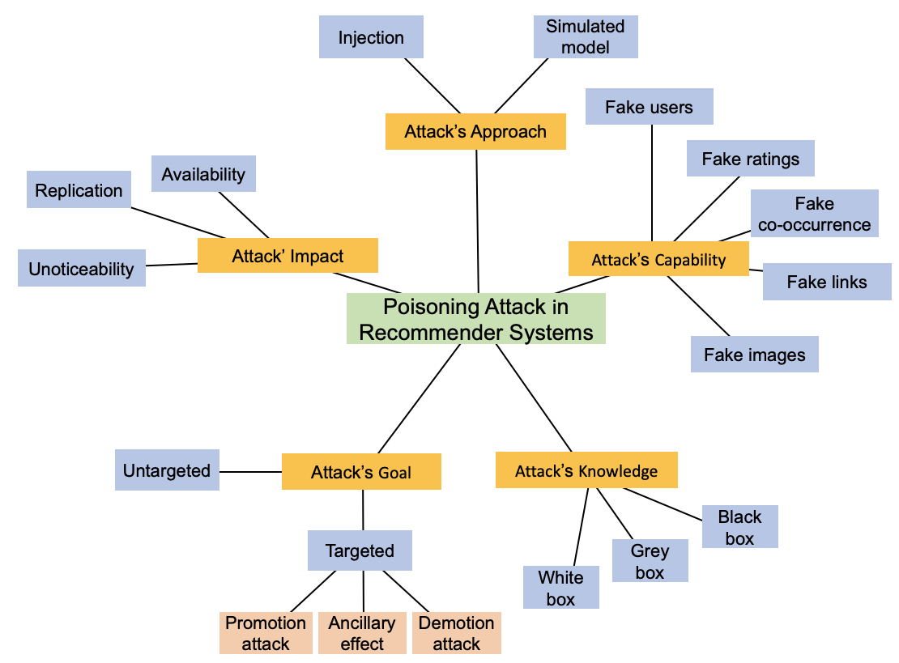

# A Survey of Poisoning Attacks and Countermeasures in Recommender Systems

A repository of poison attacks against recommender systems, as well as their countermeasures. This repository is associated with our systematic review, entitled **Manipulating Recommender Systems: A Survey of Poisoning Attacks and Countermeasures**. 

- [Existing Surveys](#existing-surveys)
- [Taxonomy](#Taxonomy)
- [Poison Attacks](#Poison-Attacks)
   - [Model-agnostic](#Model-agnostic)
   - [Model-intrinsic](#Model-intrinsic)
- [Detection Methods](#Detection-Methods)
   - [Supervised](#Supervised)
   - [Semi Supervised](#Semi-Supervised)
   - [Unsupervised](#Unsupervised)

A sortable version is available here: https://awesome-recsys-poisoning.github.io/

----------

## Existing Surveys

----------

## Taxonomy

----------

## Poison Attacks

Poisoning attacks are the process of tampering with the training data of a  machine learning (ML) model in order to corrupt its availability and integrity. Below figure presents the typical process of a poisoning attack  compared to the normal learning process. In the latter case, an ML  model is trained based on data, which is subsequently used to derive a 
recommendation. As such, the quality of the ML model depends on the quality of the data used for training. In a poisoning attack, data is injected into the training process, and hence the model, to produce unintended or harmful conclusions. 

| **Paper** | **Venue** | **Year** | **Type** | **Data** | **Code** |
| --- | --- | --- | --- | --- | --- |
| [Poisoning GNN-based recommender systems with generative surrogate-based attacks](https://doi.org/10.1145/3567420) | ACM TOIS | 2023 | Model-intrinsic | [FR](https://arxiv.org/abs/1505.03014), [ML](https://grouplens.org/datasets/movielens/100k/), [AM](http://jmcauley.ucsd.edu/data/amazon/), [LF](http://millionsongdataset.com/lastfm/) | - |
| [Shilling Black-Box Recommender Systems by Learning to Generate Fake User Profiles](https://ieeexplore.ieee.org/stamp/stamp.jsp?arnumber=9806457) | IEEE Trans. Neural Netw. Learn. Syst | 2022 | Model-agnostic | [ML](https://grouplens.org/datasets/movielens/100k/), [FT](https://guoguibing.github.io/librec/datasets.html), [YE](https://www.kaggle.com/c/yelp-recruiting/data), [AAT](http://jmcauley.ucsd.edu/data/amazon/) | - |
| [Knowledgeenhanced Black-box Attacks for Recommendations](https://dl.acm.org/doi/abs/10.1145/3534678.3539359) | KDD | 2022 | Model-agnostic | [ML](https://grouplens.org/datasets/movielens/100k/), [BC](https://www.kaggle.com/datasets/somnambwl/bookcrossing-dataset), [LA](http://millionsongdataset.com/lastfm/)  | - |
| [LOKI: A Practical Data Poisoning Attack Frameworkagainst Next Item Recommendations](https://ieeexplore.ieee.org/document/9806383) | TKDE | 2022 | Model-agnostic | [ABT](http://jmcauley.ucsd.edu/data/amazon/), [St](https://www.kaggle.com/datasets/tamber/steam-video-games),[GOW](http://snap.stanford.edu/data/loc-Gowalla.html)  | - |
| [Pipattack: Poisoning federated recommender systems for manipulating item promotion](https://dl.acm.org/doi/10.1145/3488560.3498386) | WSDM | 2022 | Model-intrinsic | [ML](https://grouplens.org/datasets/movielens/100k/), [AMP](http://jmcauley.ucsd.edu/data/amazon/) | - |
| [Poisoning Deep Learning based Recommender Model in Federated Learning Scenarios](https://www.ijcai.org/proceedings/2022/0306.pdf) | IJCAI | 2022 | Model-intrinsic | [ML](https://grouplens.org/datasets/movielens/100k/), [ADM](http://jmcauley.ucsd.edu/data/amazon/) | [Python](https://github.com/rdz98/PoisonFedDLRS) |
| [FedAttack: Effective and Covert Poisoning Attack on Federated Recommendation via Hard Sampling](https://arxiv.org/pdf/2202.04975.pdf) | Arxiv | 2022 | Model-intrinsic | [ML](https://grouplens.org/datasets/movielens/100k/), [ABT](http://jmcauley.ucsd.edu/data/amazon/)  | [Python](https://github.com/wuch15/FedAttack) |
| [UA-FedRec: Untargeted Attack on Federated News Recommendation](https://arxiv.org/abs/2202.06701) | Arxiv | 2022 | Model-intrinsic | [MIND](https://msnews.github.io/)  | [Python](https://github.com/yjw1029/UA-FedRec) | - |
| [Triple Adversarial Learning for Influence based Poisoning Attack in Recommender Systems](https://dl.acm.org/doi/10.1145/3447548.3467335) | KDD | 2021 | Model-agnostic |  [ML](https://grouplens.org/datasets/movielens/100k/), [FT](https://guoguibing.github.io/librec/datasets.html) | [Python](https://github.com/Daftstone/TrialAttack) |
| [Reverse Attack: Black-box Attacks on Collaborative Recommendation](https://dl.acm.org/doi/10.1145/3460120.3484805) | CSS | 2021 | Model-agnostic |  [ML](https://grouplens.org/datasets/movielens/100k/), [NF](https://www.kaggle.com/datasets/netflix-inc/netflix-prize-data), [AMB & ADM](http://jmcauley.ucsd.edu/data/amazon/), [TW](https://dl.acm.org/doi/10.1145/1772690.1772751), [G+](https://dl.acm.org/doi/10.5555/2999134.2999195), [CIT](https://www.aminer.org/citation/)  | - |
| [Attacking Black-box Recommendations via Copying Cross-domain User Profiles](https://ieeexplore.ieee.org/document/9458627) | ICDE | 2021 | Model-agnostic | [ML](https://grouplens.org/datasets/movielens/100k/), [NF](https://www.kaggle.com/datasets/netflix-inc/netflix-prize-data) | - |
| [Simulating real profiles for shilling attacks: A generative approach](https://www.sciencedirect.com/science/article/pii/S0950705121006523) | KBS | 2021 | Model-agnostic | [ML](https://grouplens.org/datasets/movielens/100k/) | - |
| [Ready for emerging threats to recommender systems? A graph convolution-based generative shilling attack](https://www.sciencedirect.com/science/article/pii/S0020025521007313) | IS | 2021 | Model-agnostic | [DB](https://www.kaggle.com/datasets/fengzhujoey/douban-datasetratingreviewside-information), [CI](https://paperswithcode.com/dataset/ciao) | [Python](https://github.com/silentair/GOAT/tree/7c1747d40f9bc2b5b0ac5035770b3e9f2bbd5211) |
| [Data poisoning attacks on neighborhoodbased recommender systems](https://onlinelibrary.wiley.com/doi/full/10.1002/ett.3872) | ETT | 2021 | Model-intrinsic | [FT](https://guoguibing.github.io/librec/datasets.html), [ML](https://grouplens.org/datasets/movielens/100k/), [AMV](http://jmcauley.ucsd.edu/data/amazon/) | - |
| [Data Poisoning Attack against Recommender System Using Incomplete and Perturbed Data](https://dl.acm.org/doi/10.1145/3447548.3467233) | KDD | 2021 | Model-intrinsic | [ML](https://grouplens.org/datasets/movielens/100k/), [AIV](http://jmcauley.ucsd.edu/data/amazon/) | - |
| [Black-Box Attacks on Sequential Recommenders via Data-Free Model Extraction](https://dl.acm.org/doi/10.1145/3460231.3474275) | RecSys | 2021 | Model-intrinsic | [ML](https://grouplens.org/datasets/movielens/100k/), [ABT](http://jmcauley.ucsd.edu/data/amazon/) | [Python](https://github.com/Yueeeeeeee/RecSys-Extraction-Attack) |
| [Poisoning attacks against knowledge graph-based recommendation systems using deep reinforcement learning](https://dl.acm.org/doi/abs/10.1007/s00521-021-06573-8) | Neural. Comput. Appl. | 2021 | Model-intrinsic | [ML](https://grouplens.org/datasets/movielens/100k/), [FTr](#) | - |
| [Adversarial Item Promotion: Vulnerabilities at the Core of Top-N Recommenders that Use Images to Address Cold Start](https://dl.acm.org/doi/10.1145/3442381.3449891) | WWW | 2021 | Model-intrinsic | [AMM](http://jmcauley.ucsd.edu/data/amazon/), [TC](https://www.tradesy.com/) | [Python](https://github.com/liuzrcc/AIP) |
| [Data poisoning attacks to deep learning based recommender systems](https://arxiv.org/pdf/2012.10544.pdf) | arXiv | 2021 | Model-intrinsic | [ML](https://grouplens.org/datasets/movielens/100k/), [LA](http://millionsongdataset.com/lastfm/) | - |
| [Practical data poisoning attack against next-item recommendation](https://dl.acm.org/doi/10.1145/3366423.3379992) | WWW | 2020 | Model-intrinsic | [ABT](http://jmcauley.ucsd.edu/data/amazon/) | - |
| [Influence function based data poisoning attacks to top-n recommender systems](https://dl.acm.org/doi/10.1145/3366423.3380072) | WWW | 2020 | Model-intrinsic | [YE](https://www.kaggle.com/c/yelp-recruiting/data), [ADM](http://jmcauley.ucsd.edu/data/amazon/) | - |
| [Attacking recommender systems with augmented user profiles](https://dl.acm.org/doi/10.1145/3340531.3411884) | CIKM | 2020 | Model-agnostic |  [ML](https://grouplens.org/datasets/movielens/100k/), [FT](https://guoguibing.github.io/librec/datasets.html), [AAT](http://jmcauley.ucsd.edu/data/amazon/) | - |
| [Poisonrec: an adaptive data poisoning framework for attacking black-box recommender systems](https://ieeexplore.ieee.org/document/9101655/) | ICDE | 2020 | Model-agnostic | [St](https://www.kaggle.com/datasets/tamber/steam-video-games), [AMV](http://jmcauley.ucsd.edu/data/amazon/), [ML](https://grouplens.org/datasets/movielens/100k/) | - |
| [Revisiting adversarially learned injection attacks against recommender systems](https://dl.acm.org/doi/10.1145/3383313.3412243) | RecSys | 2020 | Model-agnostic | [GOW](http://snap.stanford.edu/data/loc-Gowalla.html) | [Python](https://github.com/graytowne/revisit_adv_rec) |
| [Adversarial attacks on an oblivious recommender](https://dl.acm.org/doi/10.1145/3298689.3347031) | RecSys | 2019 | Model-intrinsic | [ML](https://grouplens.org/datasets/movielens/100k/) | - |
| [Targeted poisoning attacks on social recommender systems](https://ieeexplore.ieee.org/document/9013539) | GLOBECOM | 2019 | Model-intrinsic | [FT](https://guoguibing.github.io/librec/datasets.html) | - |
| [Data poisoning attacks on cross-domain recommendation](https://dl.acm.org/doi/10.1145/3357384.3358116) | CIKM | 2019 | Model-intrinsic | [NF](https://www.kaggle.com/datasets/netflix-inc/netflix-prize-data), [ML](https://grouplens.org/datasets/movielens/100k/) | - |
| [Poisoning attacks to graph-based recommender systems](https://dl.acm.org/doi/10.1145/3274694.3274706) | ACSAC | 2018 | Model-intrinsic | [ML](https://grouplens.org/datasets/movielens/100k/), [AMV](http://jmcauley.ucsd.edu/data/amazon/) | - |
| [Fake Co-visitation Injection Attacks to Recommender Systems](https://people.duke.edu/~zg70/papers/ndss17-attackRS.pdf) | NDSS | 2017 | Model-intrinsic | [YT](https://www.kaggle.com/datasets/rsrishav/youtube-trending-video-dataset), [eB](https://www.kaggle.com/datasets/promptcloud/ebay-product-listing-dataset), [AMV](http://jmcauley.ucsd.edu/data/amazon/), [YE](https://www.kaggle.com/c/yelp-recruiting/data), [LI](https://www.kaggle.com/datasets/killbot/linkedin) | - |
| [Data poisoning attacks on factorization-based collaborative filtering](https://proceedings.neurips.cc/paper/2016/hash/83fa5a432ae55c253d0e60dbfa716723-Abstract.html) | NIPS | 2016 | Model-intrinsic | [ML](https://grouplens.org/datasets/movielens/100k/) | [Python](https://github.com/fuying-wang/Data-poisoning-attacks-on-factorization-based-collaborative-filtering) |
| [Shilling recommender systems for fun and profit](https://dl.acm.org/doi/10.1145/988672.988726) | WWW | 2004 | Model-agnostic | [ML](https://grouplens.org/datasets/movielens/100k/) |

----------

## Detection Methods
In this section, we review detection methods in more detail, starting with supervised methods, before turning to semi-supervised methods and unsupervised methods

| **Paper** | **Venue** | **Year** | **Type** | **Data** | **Code** |
| --- | --- | --- | --- | --- |
| [Anti-FakeU: Defending Shilling Attacks on Graph Neural Network based Recommender Model](https://doi.org/10.1145/3543507.3583289) | WWW | 2023 | UnSupervised | - | - |
| [An unsupervised detection method for shilling attacks based on deep learning and community detection](https://dl.acm.org/doi/abs/10.1007/s00500-020-05162-6) | Soft Comput. | 2021 | UnSupervised | - | - |
| [Identification of Malicious Injection Attacks in Dense Rating and Co-Visitation Behaviors](https://dl.acm.org/doi/10.1109/TIFS.2020.3016827) | TIFS | 2020 | UnSupervised | - | - |
| [Recommendation attack detection based on deep learning](https://www.sciencedirect.com/science/article/pii/S2214212619306131) | JISA | 2020 | Supervised | - | - |
| [Detecting shilling attacks with automatic features from multiple views](https://www.hindawi.com/journals/scn/2019/6523183/) | Secur. Commun. Netw. | 2019 | Supervised | - | - |
| [Detecting shilling attacks in social recommender systems based on time series analysis and trust features](https://dl.acm.org/doi/abs/10.1016/j.knosys.2019.04.012) | KBS | 2019 | Supervised | - | - |
| [BS-SC: An Unsupervised Approach for Detecting Shilling Profiles in Collaborative Recommender Systems](https://ieeexplore.ieee.org/document/8862947) | TKDE | 2019 | UnSupervised | - | - |
| [Detecting shilling attacks in recommender systems based on analysis of user rating behavior](https://dl.acm.org/doi/abs/10.1016/j.knosys.2019.04.001) | KBS | 2019 | UnSupervised | - | - |
| [Trustworthy and profit: A new value-based neighbor selection method in recommender systems under shilling attacks](https://dl.acm.org/doi/10.1016/j.dss.2019.113112) | DSS | 2019 | UnSupervised | - | - |
| [Quick and accurate attack detection in recommender systems through user attributes](https://dl.acm.org/doi/10.1145/3298689.3347050) | RecSys | 2019 | UnSupervised | - | - |
| [UD-HMM: An unsupervised method for shilling attack detection based on hidden Markov model and hierarchical clustering](https://www.sciencedirect.com/science/article/pii/S0950705118300959) | KBS | 2018 | UnSupervised | - | - |
| [Shilling attack detection for recommender systems based on credibility of group users and rating time series](https://journals.plos.org/plosone/article?id=10.1371/journal.pone.0196533) | Plos One | 2018 | UnSupervised | - | - |
| [Spotting anomalous ratings for rating systems by analyzing target users and items](https://dl.acm.org/doi/abs/10.1016/j.neucom.2017.02.052) | Neurocomputing | 2017 | UnSupervised | - | - | 
| [Estimating user behavior toward detecting anomalous ratings in rating systems](https://dl.acm.org/doi/10.1016/j.knosys.2016.08.011) | KBS | 2016 | UnSupervised | - | - |
| [SVM-TIA a shilling attack detection method based on SVM and target item analysis in recommender systems](https://dl.acm.org/doi/10.1016/j.neucom.2015.12.137) | J. Neucom. | 2016 | Supervised | - | - |
| [Re-scale AdaBoost for attack detection in collaborative filtering recommender systems](https://www.sciencedirect.com/science/article/pii/S0950705116000861) | KBS | 2016 | Supervised | - | - |
| [Catch the black sheep: unified framework for shilling attack detection based on fraudulent action propagation](https://dl.acm.org/doi/10.5555/2832581.2832585) | IJCAI | 2015 | UnSupervised | - | - |
| [Shilling attacks detection in recommender systems based on target item analysis](https://journals.plos.org/plosone/article?id=10.1371/journal.pone.0130968) | Plos One | 2015 | UnSupervised | - | - |
| [A novel item anomaly detection approach against shilling attacks in collaborative recommendation systems using the dynamic time interval segmentation technique](https://dl.acm.org/doi/abs/10.1016/j.ins.2015.02.019) | IS | 2015 | UnSupervised | - | - |
| [A novel shilling attack detection method](https://www.sciencedirect.com/science/article/pii/S1877050914004347) | Procedia Comput. Sci. | 2014 | UnSupervised | - | - |
| [Detection of abnormal profiles on group attacks in recommender systems](https://dl.acm.org/doi/10.1145/2600428.2609483) | SIGIR | 2014 | UnSupervised | - | - |
| [HHT–SVM: An online method for detecting profile injection attacks in collaborative recommender systems](https://www.sciencedirect.com/science/article/pii/S0950705114001427) | KBS | 2014 | Supervised | - | - |
| [Shilling attack detection utilizing semi-supervised learning method for collaborative recommender system](https://link.springer.com/article/10.1007/s11280-012-0164-6) | WWW | 2013 | Semi Supervised | - | - |
| [𝛽P: A novel approach to filter out malicious rating profiles from recommender systems](https://dl.acm.org/doi/abs/10.1016/j.dss.2013.01.020) | DSS | 2013 | UnSupervised | - | - |
| [A Meta-learning-based Approach for Detecting Profile Injection Attacks in Collaborative Recommender Systems](http://www.jcomputers.us/vol7/jcp0701-26.pdf) | J. Comput. | 2012 | Supervised | - | - |
| [HySAD: A semi-supervised hybrid shilling attack detector for trustworthy product recommendation](https://dl.acm.org/doi/10.1145/2339530.2339684) | KDD | 2012 | Semi Supervised | - | - |
| [A clustering approach to unsupervised attack detection in collaborative recommender systems](https://www.semanticscholar.org/paper/A-Clustering-Approach-to-Unsupervised-Attack-in-Bhaumik-Mobasher/5da857634542a5d2e9b67158fbe2d93afc99412c) | ICDATA | 2011 | UnSupervised | - | - |
| [Unsupervised strategies for shilling detection and robust collaborative filtering](https://link.springer.com/article/10.1007/s11257-008-9050-4) | User Model. User-Adapt. Interact. | 2009 | UnSupervised | - | - |
| [Unsupervised retrieval of attack profiles in collaborative recommender systems](https://dl.acm.org/doi/10.1145/1454008.1454034) | RecSys | 2008 | UnSupervised | - | - |
| [Lies and propaganda: detecting spam users in collaborative filtering](https://dl.acm.org/doi/10.1145/1216295.1216307) | IUI | 2007 | UnSupervised | - | - |
| [Toward trustworthy recommender systems: An analysis of attack models and algorithm robustness](https://dl.acm.org/doi/10.1145/1278366.1278372) | TOIT | 2007 | Supervised | - | - |
| [Classification features for attack detection in collaborative recommender systems](https://dl.acm.org/doi/10.1145/1150402.1150465) | KDD | 2006 | Supervised | - | - |
| [Detecting profile injection attacks in collaborative recommender systems](https://dl.acm.org/doi/10.1109/CEC-EEE.2006.34) | CEC-EEE | 2006 | Supervised | - | - |
| [Attack detection in time series for recommender systems](https://dl.acm.org/doi/10.1145/1150402.1150508) | KDD | 2006 | UnSupervised | - | - |
| [Preventing shilling attacks in online recommender systems](https://dl.acm.org/doi/10.1145/1097047.1097061) | WIDM | 2005 | Supervised | - | - |

----------

## Datasets

| Dataset | Name |
| :-- | --- |
| [YT](https://www.kaggle.com/datasets/rsrishav/youtube-trending-video-dataset) | YouTube |
| [eB](https://www.kaggle.com/datasets/promptcloud/ebay-product-listing-dataset) | eBay |
| [AMV](http://jmcauley.ucsd.edu/data/amazon/) | Amazon Movie |
| [YE](https://www.kaggle.com/c/yelp-recruiting/data) | Yelp |
| [LI](https://www.kaggle.com/datasets/killbot/linkedin) | Linkin |
| [ML](https://grouplens.org/datasets/movielens/100k/) | MovieLens |
| [FT](https://guoguibing.github.io/librec/datasets.html) | Film Trust |
| [St](https://www.kaggle.com/datasets/tamber/steam-video-games) | Steam |
| [GOW](http://snap.stanford.edu/data/loc-Gowalla.html) | Gowalla |
| [ABT](http://jmcauley.ucsd.edu/data/amazon/) | Amazon Beauty |
| [AAT](http://jmcauley.ucsd.edu/data/amazon/) | Amazon Automotive |
| [ADM](http://jmcauley.ucsd.edu/data/amazon/) | Amazon Digital Music |
| [AIV](http://jmcauley.ucsd.edu/data/amazon/) | Amazon Instant Video |
| [THI](http://jmcauley.ucsd.edu/data/amazon/) | Tool and Home Improvement |
| [GGF](http://jmcauley.ucsd.edu/data/amazon/) | Grocery and Gourmet Food |
| [FR](https://arxiv.org/abs/1505.03014) | App Recommendation |
| [AMB](http://jmcauley.ucsd.edu/data/amazon/) | Amazon Book |
| [NF](https://www.kaggle.com/datasets/netflix-inc/netflix-prize-data) | Netflix |
| [TW](https://dl.acm.org/doi/10.1145/1772690.1772751) | Twitter |
| [G+](https://dl.acm.org/doi/10.5555/2999134.2999195) | Google+ |
| [CIT](https://www.aminer.org/citation/) | Citation Network |
| [FTr](#) | Fund Transaction |
| [DB](https://www.kaggle.com/datasets/fengzhujoey/douban-datasetratingreviewside-information) | Douban |
| [CI](https://paperswithcode.com/dataset/ciao) | Ciao |
| [AMM](http://jmcauley.ucsd.edu/data/amazon/) | Amazon Men |
| [TC](https://www.tradesy.com/) | Tradesy |
| [LA](http://millionsongdataset.com/lastfm/) | Last.fm |
| [AMP](http://jmcauley.ucsd.edu/data/amazon/) | Amazon Cell-phone |
| [BC](https://www.kaggle.com/datasets/somnambwl/bookcrossing-dataset) | Book-Crossing |
| [AA](#) | Apps for Android |
| [MIND](https://msnews.github.io/) | Microsoft News |

----------
**Disclaimer**

Feel free to contact us if you have any queries or exciting news. In addition, we welcome all researchers to contribute to this repository and further contribute to the knowledge of this field.

If you have some other related references, please feel free to create a Github issue with the paper information. We will glady update the repos according to your suggestions. (You can also create pull requests, but it might take some time for us to do the merge)

 

